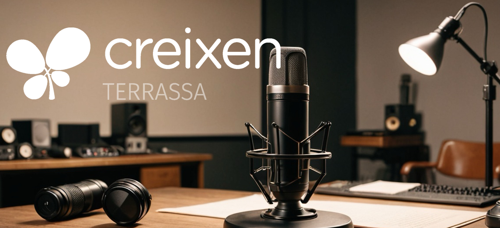

# [I3-I4] Títol: I4 reciclem!

## **Autoria**

Programació creada per Joan dins la formació en Competència Digital Docent a l’escola **Creixen Terrassa**.

## **Objectius**

La programació abordarà els principals conceptes relacionats amb el canvi climàtic i les seves repercussions, fomentant la consciència ambiental i la responsabilitat individual. Mitjançant activitats interactives i pràctiques, els estudiants exploraran les causes i els efectes del canvi climàtic, identificant accions concretes per mitigar-lo i adaptar-se a aquesta realitat. Es promourà la participació activa dels alumnes en la cerca de solucions sostenibles i es destacarà la importància de l'acció col·lectiva per afrontar aquest desafiament global.

## **Descripció de la proposta**

Aquesta proposta de programació didàctica està centrada en l'Objectiu de Desenvolupament Sostenible (ODS) número 13, "Acció pel Clima". Es tracta d'una planificació educativa destinada a estudiants de nivell I4, amb l'objectiu de conscienciar-los sobre la problemàtica del canvi climàtic i fomentar l'acció individual i col·lectiva per abordar aquesta qüestió.

La programació es basa en activitats interactives i pràctiques que permeten als estudiants explorar les causes i els efectes del canvi climàtic. A més, es busca que els alumnes identifiquin accions concretes per mitigar els impactes del canvi climàtic i adaptar-se a aquesta realitat en el seu entorn immediat.

Durant el desenvolupament del programa, es posarà èmfasi en la participació activa dels estudiants en la recerca de solucions sostenibles. Es promourà la reflexió crítica sobre la importància de l'acció col·lectiva i es ressaltarà el paper clau que tenen els individus en la lluita contra el canvi climàtic.

En resum, aquesta proposta de programació didàctica té com a objectiu principal conscienciar els estudiants sobre la importància de l'ODS 13 i dotar-los de les eines necessàries per contribuir a la mitigació del canvi climàtic des del seu entorn més proper.

## **Alumnat a qui s’adreça especialment**

El grup d'I4 mostra un alt nivell de motivació i consciència sobre el canvi climàtic, participa activament en activitats relacionades amb la sostenibilitat i l'acció pel clima. Es mostren compromesos i interessats a trobar solucions per protegir el medi ambient, fomentant la cooperació i la presa de consciència sobre la importància de cuidar el planeta des de la seva edat primerenca.

## **Interdisciplinarietat, transversalitat, relacions amb l’entorn**

La programació fomenta la interdisciplinarietat, integrant continguts de ciències naturals, geografia i educació cívica per abordar temes com el canvi climàtic i la sostenibilitat.

## Programació

# **Programació Didàctica: RECICLATGE (ODS 13)**

## **Durada: 30 hores**

## **Curs dels alumnes: I4**

## **Objectius generals:**

- **Elaborar uns panells informatius sobre què és el reciclatge i com reciclar (anunci publicitari)**
- **Consciència i Comprensió: Augmentar la consciència dels nens sobre els ODS i la importància de preservar el planeta.**
- **Valors Sostenibles: Fomentar valors sostenibles com la responsabilitat ambiental, la justícia i l'equitat.**
- **Participació Activa: Involucrar als nens en activitats pràctiques relacionades amb els ODS.**
- **Hàbits Sostenibles: Fomentar hàbits sostenibles com estalviar aigua, apagar els llums quan no s'utilitzin i reciclar.**
- **Creativitat i Expressió: Fomentar la creativitat i l'expressió artística relacionades amb els ODS.**
- **Empatia i Comprensió dels Altres: Fomentar l'empatia i la comprensió de les necessitats de les persones i dels animals en altres parts del món.**
- **Celebració i Reconeixement: Celebrar els èxits dels nens en la preservació del medi ambient i el compromís amb els ODS.**

---

## **Metodologies Utilitzades**

1. Mètode de Projectes: Proporciona als nens l'oportunitat de treballar en petits projectes relacionats amb els ODS.
2. Històries i Contes: Les històries i els contes són una manera efectiva d'introduir els ODS als nens.
3. Aprenentatge Experiencial: Els nens aprenen millor quan poden experimentar coses de primera mà.

A més a més, és important tenir en compte que l'aprenentatge dels nens de 4 anys ha de ser molt pràctic, visual i interactiu. Les activitats han de ser curtes i dinàmiques, i s'han de proporcionar moltes oportunitats per a la participació activa dels nens en el procés d'aprenentatge. També és important repetir els conceptes rellevants i utilitzar una comunicació simple i accessible per a ells.

# Programació Didàctica: **Dia 1**

## Durada: 6 hores

## Curs dels alumnes: I4

## Horari i Activitats

Text per les famílies:

Hola, família,

Avui comencem la setmana del projecte Next Generation i durant aquests dies parlarem sobre els Objectius de Desenvolupament Sostenible. Aprendrem a millorar la salut, cuidar el planeta, reciclar i crear hàbits per tal de millorar les nostres vides i la dels altres. Segur que aprendrem infinitat de coses interessants per a fer de casa nostra, un món millor.

### 9.00 - 10.00 h: **Avaluació inicial: (vídeo i àudio).**

**Dinàmica**:

- Durant l'assemblea del primer dia de la setmana, es pregunta als alumnes què coneixen sobre el canvi climàtic i els objectius de desenvolupament sostenible, així com el reciclatge. Posteriorment, farem un dibuix sobre allò que hem parlat per saber què coneixen sobre el tema. Aquesta avaluació inicial es portarà a terme al Clickedu i es podrà accedir en aquest enllaç:

[https://creixenterrassa.clickedu.eu/assignatures/eines_educatives.php?accio=administrar&assig=2613](https://creixenterrassa.clickedu.eu/assignatures/eines_educatives.php?accio=administrar&assig=2613)

Preguntes de l'avaluació inicial (gomets vermells / verd)

Saps què són els objectius de desenvolupament sostenible?

Saps què és el canvi climàtic?

Saps reciclar?

**Materials:**

- Fulls de dibuix, llapis, colors i diferents materials d’aula.

### 10.00 - 11.00 h: **Presentació I dels ODS:**

**Dinàmica**:

- A partir d’una làmina amb els diferents ODS, es presentarà als alumnes cada ODS i es portarà a terme una xerrada explicant cada un d'ells, per tal que els coneguin i què volen dir.

**Materials:**

- Pòster aula ODS

### 11:00 - 12:00: **Descans i Snack Sostenible.**

**Dinàmica**:

- Per tal de continuar treballant els ODS, sortirem al pati a esmorzar un snack sostenible i d’alimentació saludable amb envàs reciclable o reutilitzable.

**Materials:**

- Snack sostenible i saludable que porten els alumnes de casa.
- Ordinador
- Projector
- Altaveus
- Clickedu

### 12:00 - 13:00: **Presentació II i tria del nostre ODS:**

**Dinàmica**:

- Presentar als alumnes els ODS a partir d’una [presentació](https://www.youtube.com/watch?v=ygMEp4bblts) elaborada pel docent on s’explica què vol dir cada ODS i vol aconseguir que els alumnes triïn quin ODS volen treballar.

**Materials:**

- Ordinador
- Projector
- Altaveus

### 15:00 - 16:00: **Introducció al canvi climàtic.**

**Dinàmica**:

- A partir de vídeos del YouTube, s'intentarà presentar als alumnes què és el canvi climàtic i les seves conseqüències en l'actualitat, posteriorment es farà una conversa perquè tots els alumnes ho entenguin.

[Vídeo canvi climàtic](https://www.youtube.com/watch?v=2x6EdvqpwkE)

[Vídeo canvi climàtic](https://www.youtube.com/watch?v=oZo66K4vv3w) II

**Materials:**

- Ordinador.
- YouTube.
- Projector.
- Altaveus.

### 16:00 - 17:00: **Reflexió del dia.**

**Dinàmica**:

- A partir d’un dibuix, els alumnes expressaran allò que han après durant el dia i es plasmarà en el suro de l’aula, un espai destinat a presentar tot el que anem aprenent.

**Materials:**

- Paper, llapis i material d’aula.

# Programació Didàctica: **Dia 2**

## Durada: 6 hores

## Curs dels alumnes: I4

## Horari i Activitats

### 9:00 - 10:00: **Què és el reciclatge?**

**Dinàmica**:

- Es presentarà als alumnes què és el reciclatge a partir d'imatges sobre diferents materials a reciclar i els diferents contenidors disponibles per tal de portar a terme aquesta tasca tan important pel medi.
- [Joc online](https://www.cokitos.com/juego-heroe-del-reciclaje/play/) de reciclatge

**Materials:**

- Papereres de reciclatge
- Bosses d'escombraries de diferents colors
- Diferents materials de rebuig per reciclar

### 10:00 - 11:00: **Reciclem a casa?**

**Dinàmica**:

- Explicarem als alumnes que també poden reciclar a casa i cada un d'ells, elaborarà un lot de reciclatge per portar a casa i poder continuar amb la dinàmica treballada ampliant el projecte de l'escola a casa i implicant més a les famílies.

**Materials:**

- Paquet de reciclatge per alumne (bossa groga, bossa negre, bossa blava, bossa marró)

### 11:00 - 12:00: **Descans i Snack Sostenible.**

**Dinàmica**:

- Per tal de continuar treballant els ODS, sortirem al pati a esmorzar un snack sostenible i d’alimentació saludable amb envàs reciclable o reutilitzable.

**Materials:**

- Snack sostenible i saludable que porten els alumnes de casa.

### 12:00 - 13:00: Aprenem a reciclar a partir de fotografies dels contenidors amb els seus productes.

**Materials:**

- Contenidors i productes per reciclar

### 15:00 - 16:00: Scape room (vídeo i àudio)

**Dinàmica**:

- Durant la jornada els alumnes s’enfrontaran a la resolució d’un Escape Room per grups/aula.

[https://docs.google.com/presentation/d/1YvLarz-W03caiTklOnC8ZNSulyTldqZyDLdpaV1bMPo/edit#slide=id.p](https://docs.google.com/presentation/d/1YvLarz-W03caiTklOnC8ZNSulyTldqZyDLdpaV1bMPo/edit#slide=id.p)

**Materials:**

- Ordinador

### 16:00 - 17:00: Scape room

**Dinàmica**:

- Durant la jornada els alumnes s’enfrontaran a la resolució d’un Escape Room per grups/aula.

**Materials:**

- Ordinador

# Programació Didàctica: **Dia 3**

## Durada: 6 hores

## Curs dels alumnes: I4

## Horari i Activitats

### 9:00 - 10:00: Xerrada com ha anat el reciclat a casa?

**Dinàmica**:

- A partir d'una conversa els alumnes explicaran la seva experiència de com ha anat el reciclatge a casa.

**Materials:**

- Aula

### 10:00 - 11:00: Estadística/votació d'exemples inspiradors que més ens agraden.

**Dinàmica**:

- Escollir els exemples inspiradors que més ens agradin a tots els alumnes a partir d'una estadística i votacions a l'aula. Es donarà una peça de fusta a cada alumne (a manera de vot) i, a partir de les imatges de cada exemple aniran dipositant la seva votació que serà comptabilitzada a la pissarra per un altre alumne a manera d'estadística (gràfic de barres).

[Font 01](https://www.lamademoiselledufle.com/2021/10/reciclaje-carteles.html)

[Font 02](http://ceip-sanjosedecalasanzmembrilla.centros.castillalamancha.es/albumes/carteles-ganadores-del-concurso-de-carteler%C3%AD-sobre-reciclaje)

[Font 03](https://www.pinterest.com.mx/pin/762656518141983599/)

[Font 04](https://www.google.com/imgres?imgurl=https%3A%2F%2Fwww.zamoranews.com%2Fasset%2Fthumbnail%2C992%2C558%2Ccenter%2Ccenter%2Fmedia%2Fzamoranews%2Fimages%2F2022%2F09%2F23%2F2022092313502431583.png&tbnid=uBOa6HsBd1AvqM&vet=10CNkBEDMoxQFqFwoTCIiC9afX34MDFQAAAAAdAAAAABAC..i&imgrefurl=https%3A%2F%2Fwww.zamoranews.com%2Farticulo%2Fzamora%2Fmiguel-lucas-ensena-zamoranos-como-reciclar-evitar-residuos-impropios%2F20220923135128222433.html&docid=8bedCAue5qSAhM&w=640&h=385&q=carteles%20com%20reciclar&ved=0CNkBEDMoxQFqFwoTCIiC9afX34MDFQAAAAAdAAAAABAC&safe=active&ssui=on)

**Materials:**

- Projector
- Ordinador
- Pissarra
- Peces de fusta

### 11:00 - 12:00: **Descans i Snack Sostenible.**

**Dinàmica**:

- Per tal de continuar treballant els ODS, sortirem al pati a esmorzar un snack sostenible i d’alimentació saludable amb envàs reciclable o reutilizable.

**Materials:**

- Snack sostenible y saludable que porten els alumnes de casa.

### 12:00 - 13:00: Elaboració de l'obra comunicativa.

**Dinàmica**:

- Cada alumne a partir d’un dibuix farà el seu cartell sobre el reciclatge i els seus contenidors o elaborarà un en petit grup o gran grup.

**Materials:**

- Paper, llapis i material d’aula.

### 15:00 - 16:00: Elaboració de l’obra comunicativa.

**Dinàmica**:

- Cada alumne a partir d’un dibuix farà el seu cartell sobre el reciclatge i els seus contenidors.

**Materials:**

- Paper, llapis i material d’aula.

### 16:00 - 17:00: **Reflexió del dia i comunicació a les famílies.**

**Dinàmica**:

- A partir d’un dibuix, els alumnes expressaran allò que han après durant el dia i es plasmarà un mural a l’aula.
- Publicació a les famílies (canals Clickedu) de l'enllaç de la sala d’assaig virtual de la classe, amb les primeres proves de l’obra comunicativa i les pràctiques dels alumnes, via (Recomanacions + Grup de difusió de la classe).

**Materials:**

- Full de dibuix, paper embalar, llapis, colors i material escolar.
- Ordinador.

# Programació Didàctica: **Dia 4**

## Durada: 6 hores

## Curs dels alumnes: I4

## Horari i Activitats

### 9:00 - 10:00: Cinefòrum: [Wall-E (2008)](https://www.tokyvideo.com/es/video/walle-completa-en-espanol)

**Dinàmica**:

- Farem el visionament de la pel·lícula Wall-E (2008) per tal que els alumnes puguin entendre les conseqüències de no cuidar el medi ambient.

**Materials:**

- Ordinador i projector

### 10:00 - 11:00: Cinefòrum: [Wall-E (2008)](https://www.tokyvideo.com/es/video/walle-completa-en-espanol)

**Dinàmica**:

- Farem el visionament de la pel·lícula Wall-E (2008) per tal que els alumnes puguin entendre les conseqüències de no cuidar el medi ambient.

**Materials:**

- Ordinador i projector

### 11:00 - 12:00: **Descans i Snack Sostenible.**

**Dinàmica**:

- Per tal de continuar treballant els ODS, sortirem al pati a esmorzar un snack sostenible i d’alimentació saludable amb envàs reciclable o reutilitzable.

**Materials:**

- Snack sostenible i saludable que porten els alumnes de casa.

### 12:00 - 13:00: Reflexió sobre el cinefòrum del dia anterior i reflexió sobre el reciclatge.

**Dinàmica**:

- En gran grup parlarem del visionament del cinefòrum del dia anterior i reflexionar sobre la importància del reciclatge.

**Materials:**

- Aula.

### 15:00 - 16:00: Activitat amb manca d’informació (vídeo i àudio)

**Dinàmica**:

- Els alumnes a partir de QR’s hauran de buscar els diferents contenidors de reciclatge que poden fer servir per reciclar i ordenar-los segons el seu color.

**Materials:**

- Qr’s dels contenidors de reciclatge i iPads per tal de descobrir-los.

### 16:00 - 17:00: **Reflexió del dia i comunicació a les famílies.**

**Dinàmica**:

- A partir d’un dibuix, els alumnes expressaran allò que han après durant el dia i es plasmarà un mural a l’aula.

# Programació Didàctica: **Dia 5**

## Durada: 6 hores

## Curs dels alumnes: I4

## Horari i Activitats

### 9:00 - 10:00: Realització del qüestionari de l’avaluació final (vídeo i àudio)

**Dinàmica**:

- Realització del qüestionari de l’avaluació final.

**Materials:**

- ?

### 10:00 - 11:00: Presentació del Museu virtual amb les creacions dels alumnes. (vídeo i àudio)

**Dinàmica**:

- Presentació de l'Espai Virtual d'Inspiració amb les creacions dels alumnes.

**Materials:**

- 

### 11:00 - 12:00: **Descans i Snack Sostenible.**

**Dinàmica**:

- Per tal de continuar treballant els ODS, sortirem al pati a esmorzar un snack sostenible i d’alimentació saludable amb envàs reciclable o reutilitzable.

**Materials:**

- Snack sostenible i saludable que porten els alumnes de casa.

### 12:00 - 13:00: Festa de comiat del projecte i Publicació museu Virtual a les famílies.

**Dinàmica**:

- Publicació de l'Espai Virtual d'Inspiració a les famílies.

**Materials:**

- Elements de festa, pica-pica, visionat de la publicació.

### 15:00 - 16:00: Realització de visites creuades entre aules per veure les creacions dels companys.

**Dinàmica**:

- Realització de visites creuades entre aules per veure les creacions dels companys.

**Materials:**

- Museu virtual per tal d’ensenyar a la resta d’alumnat el nostre producte finalitzat.

Bon dia, Famílies!

Avui hem arribat al final de la nostra activitat sobre els ODS, però no sense dir-vos que visiteu el nostre espai Virtual, l'enllaç del qual, vam enviar dimecres. Us volem agrair el fet d'haver compartit amb els vostres fills i filles aquesta experiència tan enriquidora sobre la importància dels ODS en el nostre món actual.

### 16:00 - 17:00: **Reflexió del dia.**

**Dinàmica**:

- Parlar en gran grup de què han après durant aquestes jornades.

**Materials:**

- Aula.

